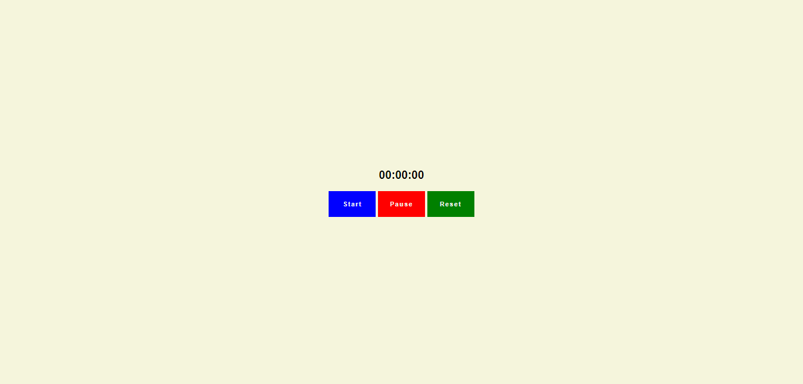

# Projeto de um contador

Nesse projeto simples, o objetivo é criar um contador.

## Stack utilizada

**Front-end:** HTML, CCS, JavaScript

## Layout

## Ver o resultado do contador

[Contador](https://contador-simples.netlify.app/)